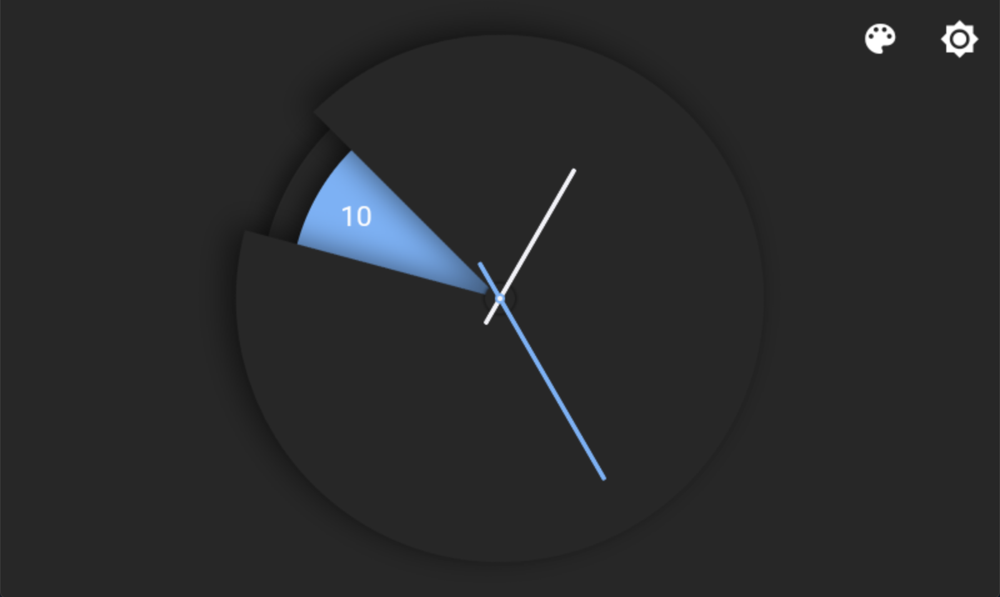
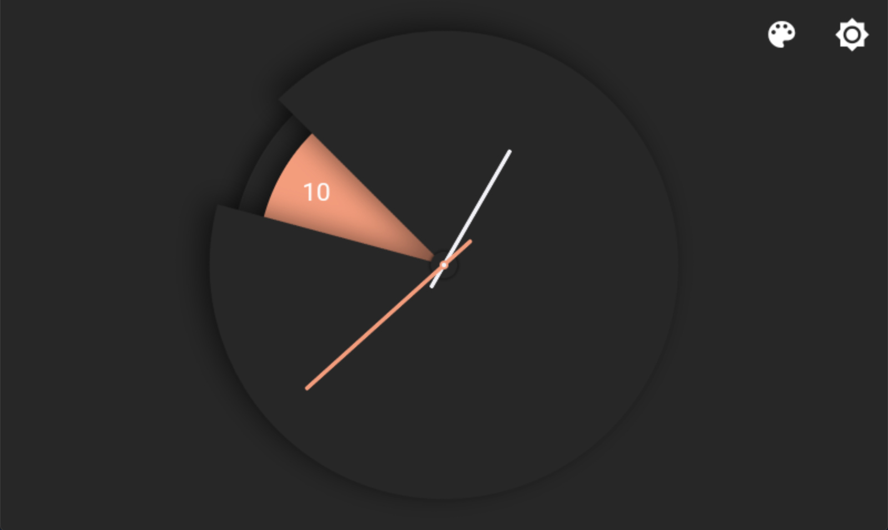
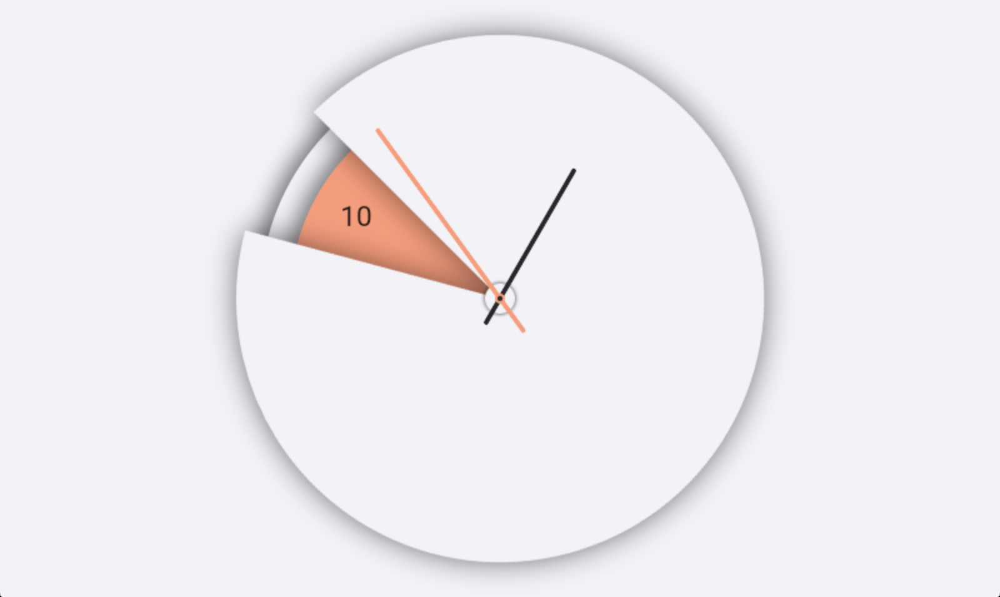
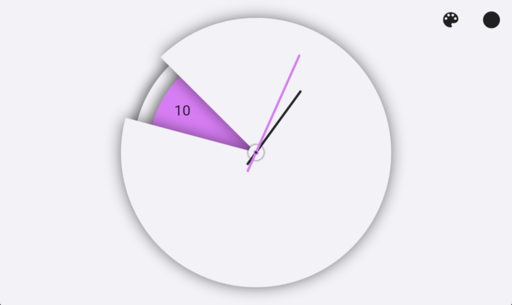

# Sette Clock

This app is an elegant implementation of an analog clock.
Focusing primarily on simplicity this clock can easily be read by users who previously only understood digital clocks.
The design uses negative space to highlight the hour, with a simple minute and second hand.

The only problem I faced was adding a shadow to a custom painted widget, for this reason I used images for the clocks light/dark hour hand. I successfully painted the hour hand, however, the shadow had sharp corners and really took away from the design. The images handle very well in the design.

## Examples of Light/Dark Mode
Along with changing the theme, you can also change the primary color. 

## Dark Theme

## light Theme

